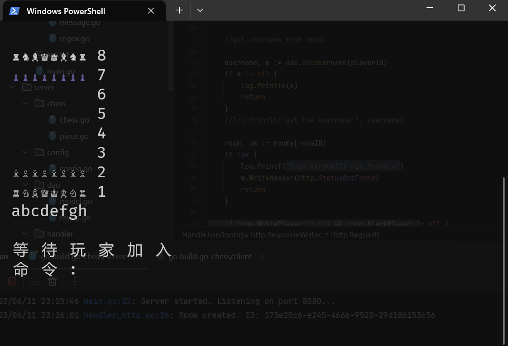
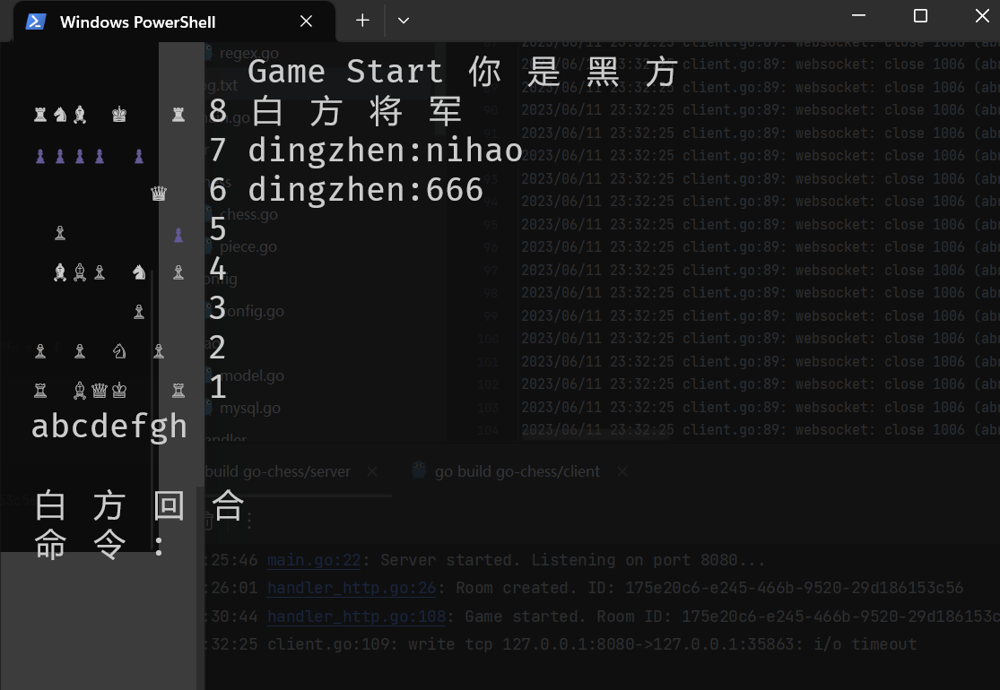

# Go-chess

## GUI

- tcell https://github.com/gdamore/tcell

## 网络通信

- 登录注册模块：http

- 游戏模块：websocket  https://github.com/gorilla/websocket

## 接口说明

### 注册

请求路径

```http
POST /registry
```

请求参数

| 名称     | 位置 | 类型   | 必选 | 说明   |
| -------- | ---- | ------ | ---- | ------ |
| username | body | string | 是   | 用户名 |
| password | body | string | 是   | 密码   |

### 登录

请求路径

```http
POST /login
```

请求参数

| 名称     | 位置 | 类型   | 必选 | 说明   |
| -------- | ---- | ------ | ---- | ------ |
| username | body | string | 是   | 用户名 |
| password | body | string | 是   | 密码   |

返回参数

| 字段名        | 位置   | 必选 | 类型   | 说明 |
| ------------- | ------ | ---- | ------ | ---- |
| Authorization | header | 是   | string | jwt  |

### 创建房间

请求路径

```http
POST /room
```

返回参数

| 字段名 | 位置   | 必选 | 类型   | 说明   |
| ------ | ------ | ---- | ------ | ------ |
| roomID | header | 是   | string | 房间id |

### 进入房间

请求路径

```http
GET /join
```

请求参数

| 名称          | 位置   | 类型   | 必选 | 说明   |
| ------------- | ------ | ------ | ---- | ------ |
| rooID         | query  | string | 是   | 房间id |
| Authorization | header | string | 是   | jwt    |

## 快速开始

进入房间后界面如图



1. esc 切换聊天/命令模式

2. 命令模式下：

   - 移动：e2e3
   - 王车易位：O-O-O（长）、O-O（短）
   - 兵升变：e7e8=Q （Q 后、R 车、N 马、B 象）

   回车发送指令

3. 聊天模式下，回车发送

游戏截图




访问地址 
43.139.153.160:8080 需要修改客户端中连接服务器的url

注意：客户端登录后创建房间时会直接进入房间，导致看不到房间id，解决方法是先创建房间再登录再进入房间进行游戏。
